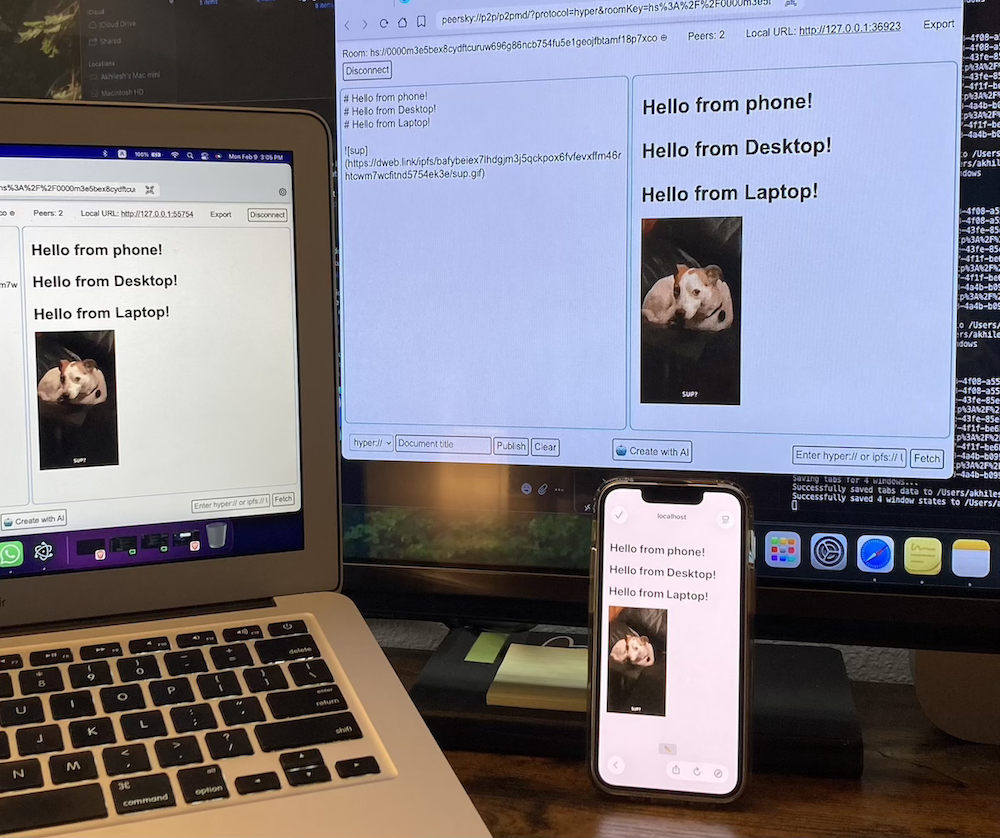
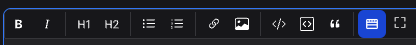
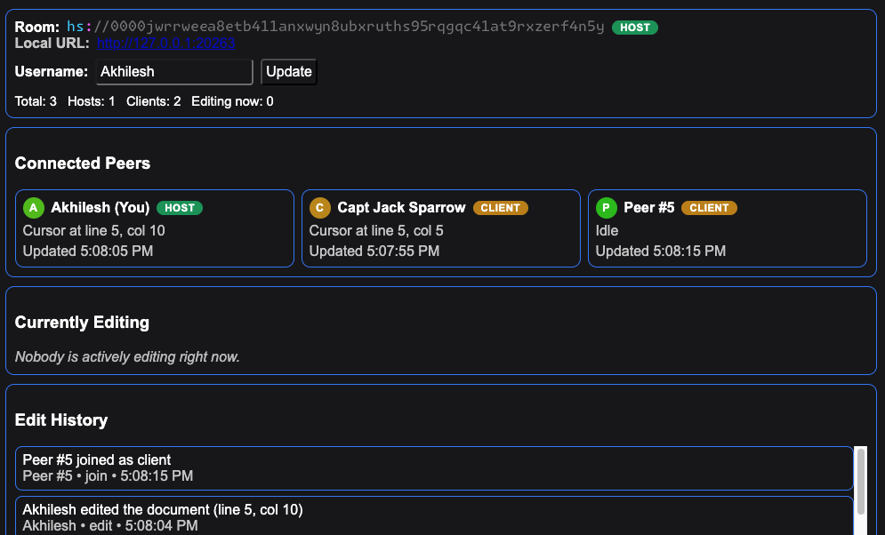
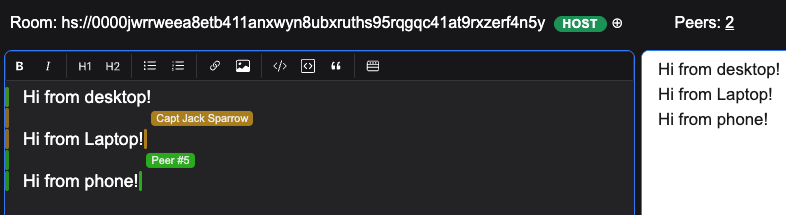
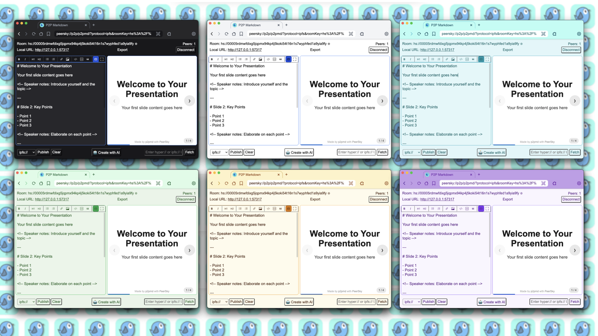

# P2P Markdown

<div align="center">
    
</div>

P2P Markdown is a real-time, peer-to-peer collaborative markdown editor built into [PeerSky Browser](https://github.com/p2plabsxyz/peersky-browser). It connects peers directly using [Holesail](https://holesail.io/) keys, syncs edits live, and lets you publish or export your content without relying on centralized servers.

## What it does
- Real-time P2P collaboration over Holesail (direct, encrypted connections)
- Incremental CRDT document sync with Yjs (plus safe fallback sync path)
- Join or host rooms using `hs://` keys
- Local publishing to `hyper://` or `ipfs://`
- Optional HTTPS sharing for IPFS-published content via `dweb.link` URL mapping
- Presentation slides mode with speaker notes and navigation
- Drag-and-drop image upload to IPFS (auto-compressed, inserted as markdown)
- Draft storage using local Hyperdrive
- Content generation via local LLMs (with slides format support)
- Offline KaTeX math rendering for inline (`$...$`) and block (`$$...$$`) LaTeX notation
- Scientific writing templates (Research Paper with IEEE two-column preview/export, Technical Documentation)
- Export to HTML, PDF, or Slides — fully offline, no CDN dependencies (check [export examples](./examples))
- SSE keepalive + auto-reconnect for mobile/idle clients
- Peer visibility dashboard for connected peers, roles, live editing state, and edit history
- Colored cursor and line traces with hover name chips for collaborative context

## Features

### Slides Mode
Create presentations with markdown using `---` to separate slides:
```markdown
# Title Slide
Your opening content
<!-- Speaker notes: Introduce yourself and topic -->
---
# Key Points
- Point 1
- Point 2
<!-- Speaker notes: Elaborate on each point -->
```

**Navigation:**
- Arrow keys: `←` / `→` to navigate slides
- Click left/right half of screen to navigate
- Progress bar and slide counter at bottom
- Auto-detection: slides render automatically when `---` delimiters are present

**Features:**
- Speaker notes as HTML comments (hidden from slides, visible in markdown)
- Full-screen preview mode
- Export/publish as interactive HTML slides
- Footer with p2pmd and PeerSky branding

### Math & Scientific Writing

p2pmd supports offline LaTeX math rendering via [KaTeX](https://katex.org/) — no internet connection required.

**Enabling LaTeX mode:**
1. Click the **∞ (Infinity)** button in the toolbar to toggle LaTeX mode ON
2. The button turns **blue** when active (like slides mode)
3. Inline Math and Block Math buttons appear adjacent to the toggle
4. Research Paper and Technical Documentation options appear inline in the toolbar beside the ∞ mode toggle

**KaTeX syntax:**
- Inline math: `$E = mc^2$` renders as $E = mc^2$
- Block math:
  ```
  $$
  \frac{-b \pm \sqrt{b^2 - 4ac}}{2a}
  $$
  ```

**Templates:**

| Template | Description |
|----------|-------------|
| Research Paper | IEEE-style two-column paper with title, abstract, method, results, and references. Exports with A4 page, IEEE margins, two-column layout. |
| Technical Documentation | Implementation-focused template with API table, quick start, and throughput estimates. |

**IEEE export mode:**
When LaTeX mode is ON, the document contains a top marker `<!-- ieee -->`, and the Research Paper template is active, the live preview and exported HTML/PDF switch to IEEE-inspired formatting:
- A4 page with IEEE-standard margins (Top: 0.75in, Bottom: 1.0in, Left/Right: 0.625in)
- Two-column layout with 0.25in gap
- Structured title, author, and abstract front matter
- Times New Roman serif font at 10pt
- "made by p2pmd" footer at bottom right

**Offline exports:**
All exported HTML, PDF, and Slides inline KaTeX CSS and bundled font assets — no CDN dependencies. Exported files render math correctly even without internet.

### Formatting Toolbar



Quick formatting buttons with keyboard shortcuts:
- **Bold** (`Ctrl/Cmd+B`): `**text**`
- **Italic** (`Ctrl/Cmd+I`): `*text*`
- **Heading 1**: `# text`
- **Heading 2**: `## text`
- **Bullet List**: `- item`
- **Numbered List**: `1. item`
- **Link** (`Ctrl/Cmd+K`): `[text](url)`
- **Image**: ``
- **Inline Code**: `` `code` ``
- **Code Block**: ` ```language\ncode\n``` `
- **Quote**: `> text`
- **LaTeX Mode** (∞): Toggle math/template toolbar — icon turns blue when active
- **Inline Math**: `$expression$`
- **Block Math**: `$$expression$$`
- **Slides Mode**: Toggle presentation view

### Peers Dashboard



- Peer count opens `./peers.html` with room context.
- Connected peers list with role badges (`host` / `client`) and live cursor status.
- "Currently Editing" panel for active typers.
- "Edit History" panel for join/leave/edit activity.

### In-Editor Visibility



- Host/client role badge next to the room key.
- Peer count with quick navigation to the peers dashboard.
- Colored cursor indicators for active collaborators.
- Persistent colored line traces with hover labels showing editor names.
- Fallback naming (`Peer #N`) for unnamed peers.

### Themes



## Security
P2PMD implements production-grade security measures:
- **Encrypted Seeds**: Room keys encrypted at rest using Electron's `safeStorage` (OS-level keychain)
- **Rate Limiting**: DoS protection (5 room creations/min, 10 rehosts/min)
- **CORS Policy**: Protocol-level origin validation prevents external API access
- **Minimal Logging**: Sensitive data (keys, seeds) redacted from production logs
- **Modern API**: Uses Electron's `protocol.handle()` with native Request/Response objects

## How it works (high level)
- The editor hosts a local HTTP session and syncs content using incremental Yjs CRDT updates (with a full-state fallback path when needed).
- On reconnect, CRDT state is merged so edits made during temporary disconnects are preserved.
- Peer metadata (role, cursor, typing, and line hints) is shared via SSE + presence endpoints to power the peers page.
- Holesail creates a direct peer connection using a shared key.
- Publishing writes to Hyper/IPFS, making content shareable via P2P URLs.
- Drag an image onto the editor to upload it to IPFS. Images are compressed (resized to max 1920px, re-encoded at 0.8 quality) before upload. GIFs are uploaded as-is to preserve animation. The resulting markdown link uses a `dweb.link` gateway URL.

## Access 
### Desktop
Download [PeerSky Browser](https://peersky.p2plabs.xyz/) and open `peersky://p2p/p2pmd/` to access p2pmd.

### Mobile
To open p2pmd on your phone:
1. Download the Holesail mobile app ([iOS](https://apps.apple.com/us/app/holesail-go/id6503728841)/[Android](https://play.google.com/store/apps/details?id=io.holesail.holesail.go&hl=en_US&pli=1))
2. Enter the room key (`hs://...`) in the app to connect as a client
3. Open the localhost URL (e.g., `http://127.0.0.1:8989`) in your phone's browser
4. Edit and collaborate in real-time with desktop peers

**Note:** A dedicated p2pmd iOS/Android app with native editing would provide a similar experience without needing the Holesail app as an intermediary.

## Build a similar P2P realtime app

### 1) Start a Holesail server
```js
import Holesail from "holesail";

const server = new Holesail({
  server: true,
  secure: true,
  port: 8989
});

await server.ready();
console.log("Share this key:", server.info.url);
```

### 2) Connect a client
```js
import Holesail from "holesail";

const client = new Holesail({
  client: true,
  key: "hs://s000yourkeyhere"
});

await client.ready();
console.log("Connected:", client.info);
```

More: https://docs.holesail.io/

### 3) Sync realtime state
Use HTTP endpoints (GET/POST) plus SSE/WebSocket for live updates. In PeerSky, a custom [hs-handler](https://github.com/p2plabsxyz/peersky-browser/blob/main/src/protocols/hs-handler.js) can expose these endpoints while keeping the transport peer-to-peer. Incremental Yjs CRDT updates are exchanged over HTTP/SSE, while peer presence metadata is sent through presence endpoints.

### 4) Publish to Hyper
```js
async function publishToHyper(file) {
  const response = await fetch(`hyper://localhost/?key=myapp`, { 
    method: 'POST' 
  });
  const hyperdriveUrl = await response.text();
  
  const uploadUrl = `${hyperdriveUrl}${encodeURIComponent(file.name)}`;
  const uploadResponse = await fetch(uploadUrl, {
    method: 'PUT',
    body: file,
    headers: { 'Content-Type': file.type || 'text/html' }
  });
  
  if (uploadResponse.ok) {
    console.log('Published to:', uploadUrl);
    return uploadUrl;
  }
}
```

### 5) Publish to IPFS
```js
async function publishToIPFS(files) {
  const formData = new FormData();
  for (const file of files) {
    formData.append('file', file, file.name);
  }
  
  const response = await fetch('ipfs://bafyaabakaieac/', {
    method: 'PUT',
    body: formData
  });
  
  if (response.ok) {
    const ipfsUrl = response.headers.get('Location');
    console.log('Published to:', ipfsUrl);
    return ipfsUrl;
  }
}
```

These examples show the core patterns used in p2pmd. You can adapt them to build your own P2P apps in PeerSky.

